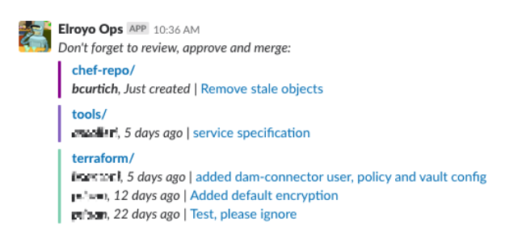

# Bitreminder

[](https://travis-ci.org/briancurt/bitreminder)
[](https://codeclimate.com/github/briancurt/bitreminder/maintainability)
[](https://github.com/briancurt/bitreminder)

> Send your team scheduled Slack messages to inform about pending pull requests in the [Bitbucket Server](https://bitbucket.org/product/enterprise) projects they care about. Run it locally or on [AWS Lambda](https://aws.amazon.com/lambda/) with [Zappa](https://github.com/Miserlou/Zappa)!





## Installation

#### Pre-requisites

- Slack Bot user API token (`xoxb-...`). If you don't have one yet, read how to get one [here](https://api.slack.com/bot-users)
- Username and password on your self-hosted Bitbucket Server (formerly known as Atlassian Stash)
- Your AWS credentials properly configured (only required for [Serverless deployment](#serverless-deployment))
- Python 3.6 or above

#### Quick start

```bash
# Clone the project and install the dependencies

git clone https://github.com/briancurt/bitreminder.git
cd bitreminder/
pip install -r requirements.txt

# Set your credentials as environment variables

export "SLACK_API_TOKEN"="xoxb-.........."
export "BITBUCKET_USER"="coolusername"
export "BITBUCKET_PASS"="hunter2"

# Configure your alerts

mv config.example.yaml config.yaml
vi config.yaml

# Try it out!

python -c "import scheduled; scheduled.reminder()"

```

You can choose to run it manually on-demand as shown above, or even set it up as a cron job, if that works for you. However, for a more serious set up I recommend deploying it as a _serverless_ application: 

#### Serverless deployment

It's really simple thanks to the awesome [Zappa](https://github.com/Miserlou/Zappa) project. You will only have to create a virtualenv and tune up `zappa_settings.json` to your taste. Step by step, that would be:

```bash
# Clone the project

git clone https://github.com/briancurt/bitreminder.git
cd bitreminder/

# Set up your virtual environment and install the dependencies

pip install virtualenv
virtualenv -p python3.6 venv
source venv/bin/activate
venv/bin/pip install -r requirements.txt

# Configure your alerts

mv config.example.yaml config.yaml
vi config.yaml

# Configure your Zappa settings. The example should be enough
# to get you started. For all options available head to Zappa's
# documentation: https://github.com/Miserlou/Zappa#advanced-settings

mv zappa_settings.example.json zappa_settings.json
vi zappa_settings.json

# Deploy it!

venv/bin/zappa deploy event

```


## Development

Just clone the repository and set up your virtual environment as shown above. You can then change whatever you want, and try it out running the function locally.


## To do

- [x] Add some static code checks
- [x] Get Slack's channel ID from a given channel name
- [ ] Try out Atlassian's Bitbucket client instead of requests
- [ ] Improve message formatting
